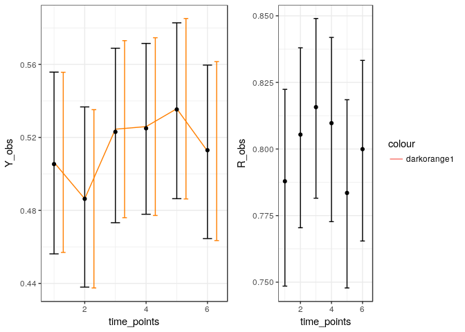

NiNBayes
========

About
-----

The purpose of this package is to implement *N*on-*i*gnorable *N*onparametric *Bayes* estimation procedures. Emphasis is given to conducting methods which allow the user to conduct a sensitivity analysis by using different assumptions. We allow for both fully-Bayes estimation of aspects of the full-data distribution and (more usefully?) multiple imputation of data under different assumptions about the missing data.

For relevant details about what this package is trying to accomplish, see [Linero and Daniels (2017)](https://ani.stat.fsu.edu/~arlinero/assets/documents/GeneralBNPApproach.pdf).

Installation
------------

If nessecary, first install the dependencies

``` r
install.packages(c("MCMCpack", "tidyverse", "gridExtra", "Rcpp", "RcppArmadillo", "mitools", "bindata"))
```

The package is installed using the `devtools` package, which should also be installed. In order to use `devtools`, Windows users should have the `Rtools` toolchain installed, while OSX users may need to install Xcode from the app store; if further help is needed, [see here](https://www.rstudio.com/products/rpackages/devtools/).

``` r
install.packages("devtools")
```

The following command installs the packages, and should work on OSX, Windows, and Linux.

``` r
library(devtools)
install_github("theodds/NiNBayes")
```

Using the package
-----------------

This package is currently in a very preliminary status. Right now, the package allows for analyzing simple multivariate binary data, though there are plans in the future to (1) allow for the inclusion of covariates and (2) allow for continuous responses.

We illustrate on the following simple example, where missingness is MCAR. First, we make fake data using the `bindata` package.

``` r
library(bindata)
library(NiNBayes)

set.seed(1234)
make_fake_data <- function(N = 500, J = 6, rho = .4) {
  Sigma <- (1 - rho) * diag(J) + rho
  Y <- rmvbin(N, margprob = rep(.5, J), sigma = Sigma)
  R <- rmvbin(N, margprob = rep(.8, J), sigma = Sigma)
  Y <- ifelse(R == 1, Y, NA)
  
  return(list(Y = Y, R = R))
}

fake_data <- make_fake_data()
```

Next, we fit the MNAR PARAFAC working model, and an MAR equivalent which does not model the missingness. This may take a moment to complete. The parameter `sigma_a` is a tuning parameter which I set to roughly equal to the number of clusters the PARAFAC model finds in the data (as measured by `rowSums(fit$class_counts > 0)`).

``` r
fit_mnar <- ParafacMNAR(Y = fake_data$Y, R = fake_data$R, sigma_a = 8, nburn = 1000, nsave = 1000, nthin = 1)
fit_mar <- ParafacMAR(Y = fake_data$Y, R = fake_data$R, sigma_a = 8, nburn = 1000, nsave = 1000, nthin = 1)
```

The output of these commands is the result of running a Markov chain. The chains above are somewhat short, and users may want to run longer chains in practice. The easiest way to make use of the fits is to use multiple imputation.

``` r
imputes_ccmv <- ParafacMI(Y = fake_data$Y, R = fake_data$R, chain = fit_mnar, 
                          num_impute = 20, method = "CCMV")
imputes_nip <- ParafacMI(Y = fake_data$Y, R = fake_data$R, chain = fit_mnar, 
                         num_impute = 20, method = "NIP", j_0 = 6)
imputes_mar <- ParafacMI(Y = fake_data$Y, R = fake_data$R, chain = fit_mar, 
                         num_impute = 20, method= "MAR")
```

The objects produced above are lists with `num_impute` components consisting of a completed dataset `Y`. For example

``` r
head(imputes_ccmv[[1]])
```

    ##      [,1] [,2] [,3] [,4] [,5] [,6]
    ## [1,]    0    1    1    0    1    1
    ## [2,]    0    0    0    0    0    0
    ## [3,]    0    0    1    0    0    0
    ## [4,]    0    1    1    0    0    1
    ## [5,]    0    0    0    0    0    0
    ## [6,]    1    0    0    0    0    0

``` r
head(imputes_nip[[1]])
```

    ##      [,1] [,2] [,3] [,4] [,5] [,6]
    ## [1,]    0    1    1    0    1    1
    ## [2,]   NA    0   NA    0    0    0
    ## [3,]    0    0    1    0    0    0
    ## [4,]    0    1    1    0    0    1
    ## [5,]    0    0    0    0    0    0
    ## [6,]    1    0    0    0    0    0

Importantly, note that imputations under nearest identified pattern (NIP) still have `NA`'s in columns other than `j_0 = 6`. This is because NIP is a marginal restriction; the user must specify which marginal they are interested in imputing. In principle, one could impute from all marginals simultaneously (this is more efficient), but we intentionally do not allow this to prevent users from making mistakes when using `NIP`.

Users can then combine inferences applied on each of these datasets using standard MI techniques; for example, using the `mitools` package, we can get a point estimate and standard error for the mean response at the end of the study under CCMV.

``` r
library(mitools)
mean_ccmv <- lapply(imputes_ccmv, function(x) mean(x[,ncol(x)]))
var_ccmv <- lapply(imputes_ccmv, function(x) var(x[,ncol(x)]) / nrow(x))
MIcombine(mean_ccmv, var_ccmv)
```

    ## Multiple imputation results:
    ##       MIcombine.default(mean_ccmv, var_ccmv)
    ##   results         se
    ## 1  0.5199 0.02438064

This is also more flexible, in that users can apply different analysis models to the imputed datasets. We also allow for Monte Carlo integration for computing effects for the marginal distribution. This is a slower, less flexible, alternative to MI, but it is more exact and can be used to check that MI is giving reasonable answers relative to a fully-Bayesian analysis.

``` r
mu_ccmv <- GcompCCMV(fit_mnar)
mu_nip <- GcompODMV(fit_mnar, j_0 = 6)
```

### Sensitivity parameters

In the current version of this package, there is only one imputation method which allows incorporation of sensitivity parameters: the Tilted Last Occasion assumption. See Linero and Daniels (2017) for more details. This requires providing, in addition to the marginal we want to impute, a sensitivity parameter *ξ* to be used in exponential tilting for each imputed dataset. For example, if *ξ* ∼ Uniform(0,1) we might do the following:

``` r
imputes_tlo <- ParafacMI(Y = fake_data$Y, R = fake_data$R, chain = fit_mnar, 
                         num_impute = 20, method = "TLO", j_0 = 6, xi = runif(20))
```

### Sanity checks for model fit

There is currently not much to speak of in the way of model diagnostics, but one sanity check is to check that inferences on *identified* parameters can be reproduced by the model. The simplest thing to look at is the marginal means of *R*<sub>*j*</sub> and of (*Y*<sub>*j*</sub>|*R*<sub>*j*</sub> = 1). The convenience function `ParafacObserved` computes these:

``` r
marginal_means <- ParafacObserved(fit_mnar, fake_data$Y, fake_data$R, do_plot = TRUE)
```


